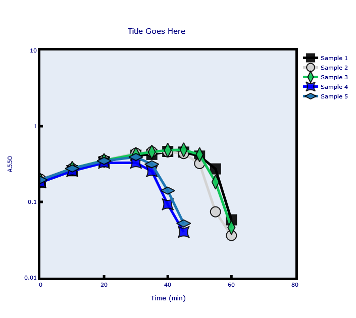
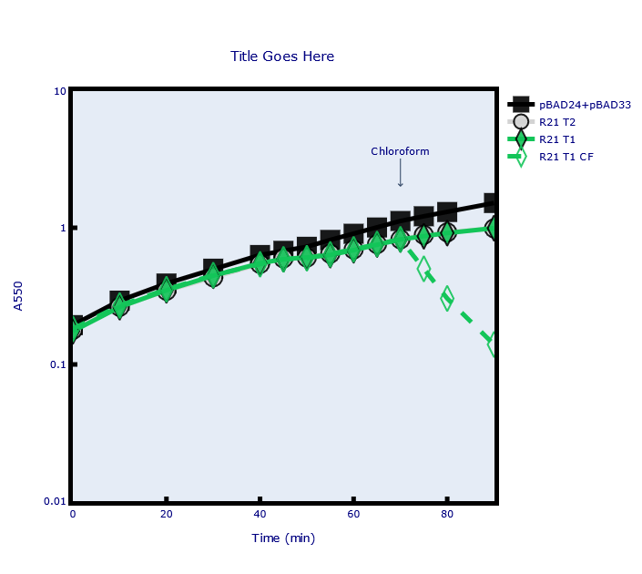
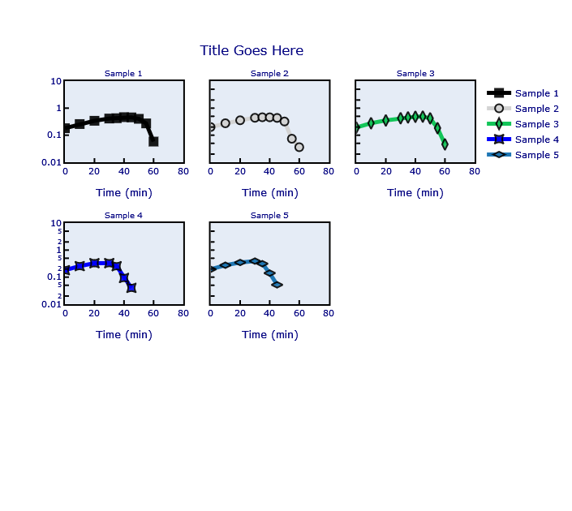

[](https://zenodo.org/badge/latestdoi/301024313)
# Lysis-curve

This package generates automated lysis curves (bacterial growth curves) for 
biological research via **Plotly** and uses code to generate automated grouping, titles, annotations and subplotting within a single custom graphing function. Simply changing the function arguments can generate a variety of bacterial growth curves.


This makes generating growth/lysis curves as simple and quick as possible, even for people with minimal programming skills.

**The graphs are dynamic** when generated within a webpage (e.g. **Jupyter**) which can be useful when teasing apart data.

For a very similar package which generates non-dynamic but prettier bacterial growth curves / lysis curves using **R** rather than **Python**, see [Cody Martin's lysis_curves package.](https://github.com/cody-mar10/lysis_curves)

### Install Package Using [Pip](https://pypi.org/project/lysis-curve/)
At the command line, run
```Bash
pip install lysis-curve
```
This should also install all necessary dependencies.

### Running (in Jupyter or at command line)

First, make sure your x-axis (time) data is your **zeroth (first) column** (this script always plots the first column in the csv file as the x-axis). Next, **make sure you save your data in the .csv file format.**

Next, navigate to the directory containing your .csv file (in the terminal, or in Jupyter).
```python
import os
os.chdir('your_path_here')
```
Next, import the lysis_curve() function using 
```python
from lysis_curve import lysis_curve
```
Alternatively, copy/paste the file into a jupyter cell from github
and you can modify the code yourself.
#### Generate basic plot
```python
lysis_curve('yourcsvfile.csv')
```



#### Generate plot with grouping
This argument is useful if you wish to visually group your data by color. 
It automatically sets each line in each group the same color, 
but assigns them different markers.
*Does not work with subplots.*
Pass the argument `group` as a list of strings, with each column in a group separated by vertical bars.
```python
lysis_curve('122120JSC.csv',
           group = ['1', '4','3|5'],
           annotate=True)
```


#### Generate plot with annotations
Use the argument ```annotations=True``` and follow the prompts.

#### Generate plot with subplots
Use the argument ```subplots=True``` to split your data into subplots.

```Python
lysis_curve('051321JSC.csv',
           subplots=True)
```

#### Generate plot with custom title
Use the argument ```title='Your Custom Title Here'```
By default, the title will be taken from your csv file name - thus 'yourcsvfile' if 'yourcsvfile.csv' is passed.

#### Pass custom colors
```python
lysis_curve('yourcsvfile.csv', colors=['red', 'blue', 'blah'])
```
You should be able to pass any color to ```colors``` that you can find in this [link](https://developer.mozilla.org/en-US/docs/Web/CSS/color_value).

#### Save as .png
Set the argument ```png=True``` and the function will generate a .png file of the graph in your current directory.

#### Save as .svg
Set the argument ```svg=True``` and the function will generate a .svg file of the graph in your current directory.
Requires Kaleido or Orca

### Save .png, .svg and legendless .svg
```save=True```
Saves three versions of the graph: (1) a .png version with a legend (2) a .svg version with a legend (3) a .svg version without a legend and square dimensions

### Dependencies

* Python 3.5+
* Pandas ```pip install pandas```
* Plotly ```pip install plotly```
* Requests ```pip install requests```
* Kaleido ```pip install kaleido``` (Kaleido is recommended over Orca according to Plotly)
